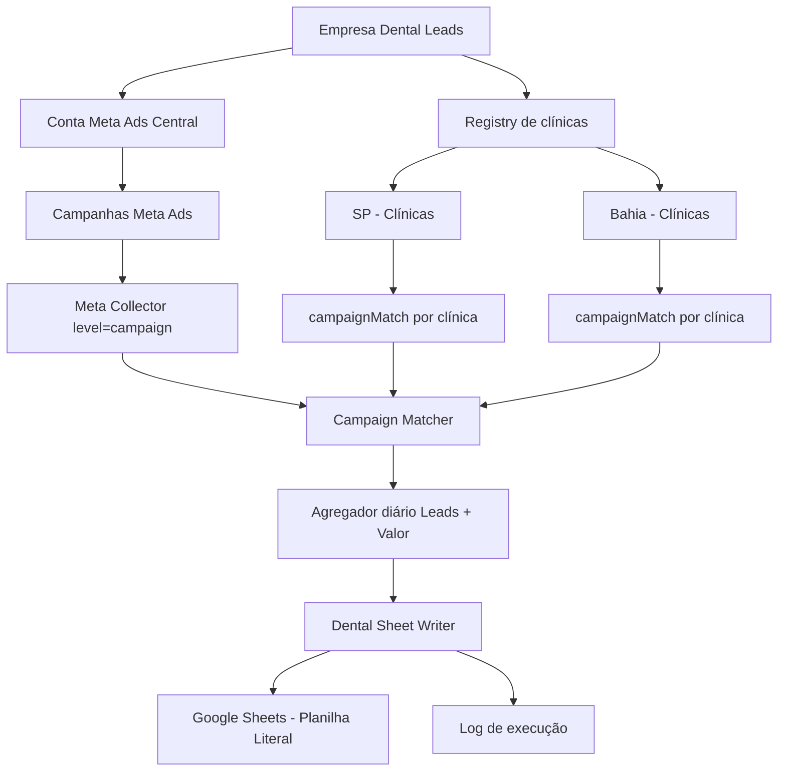
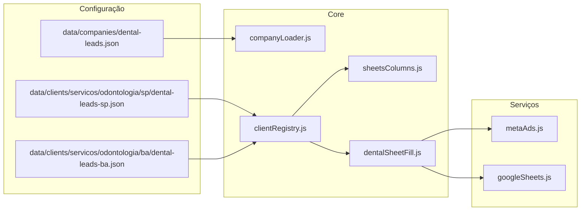
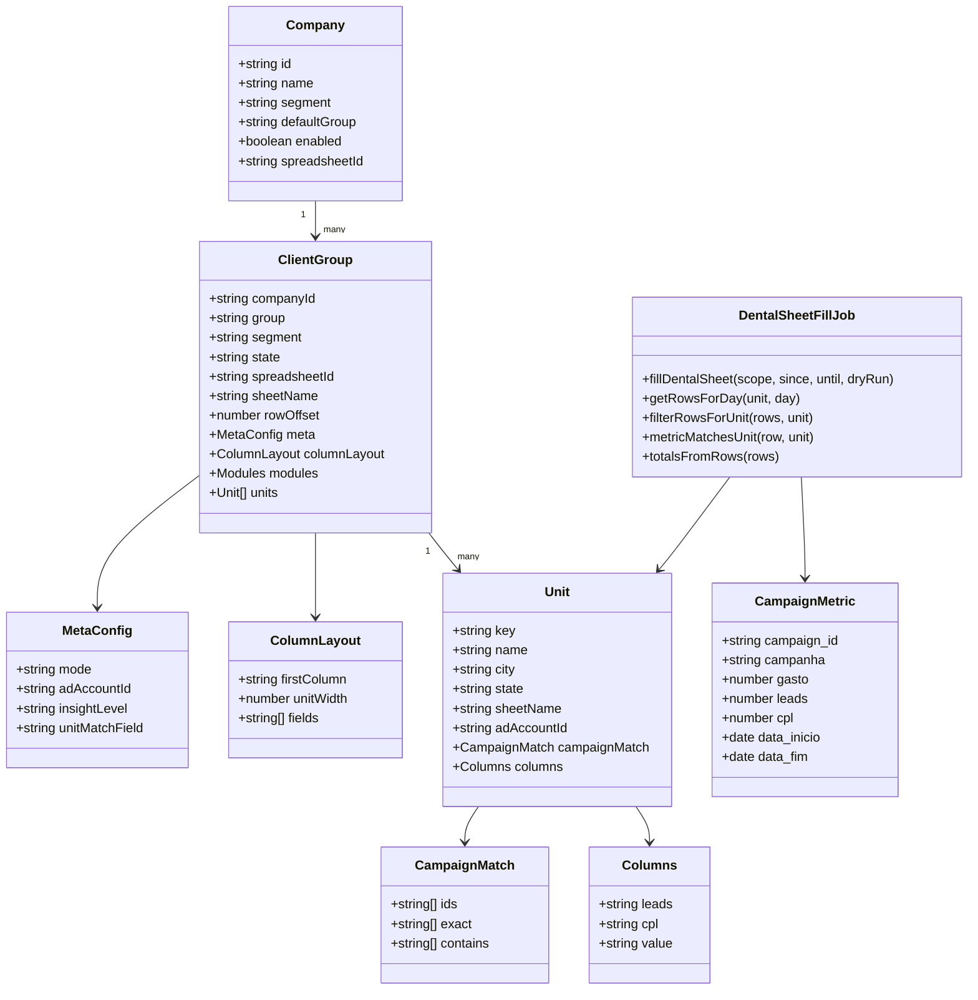
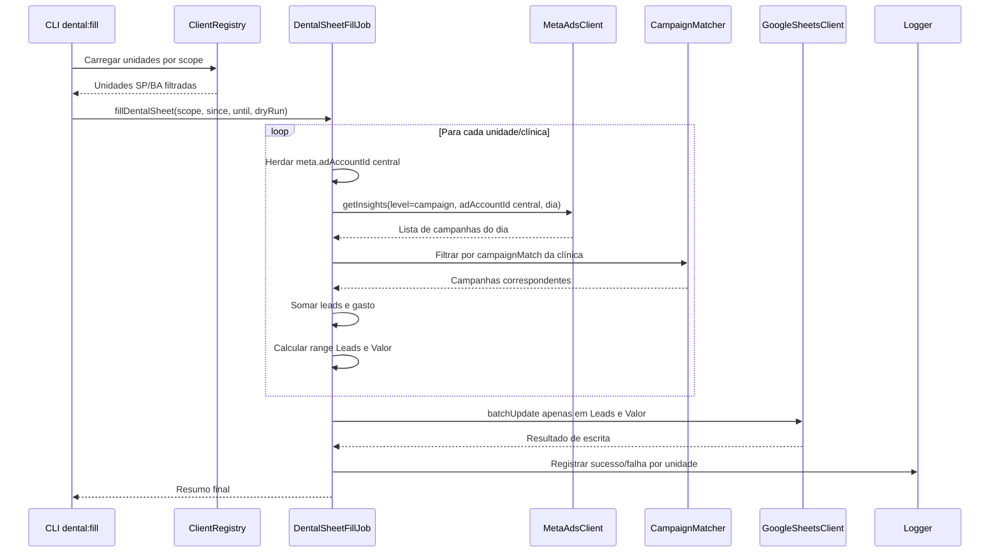
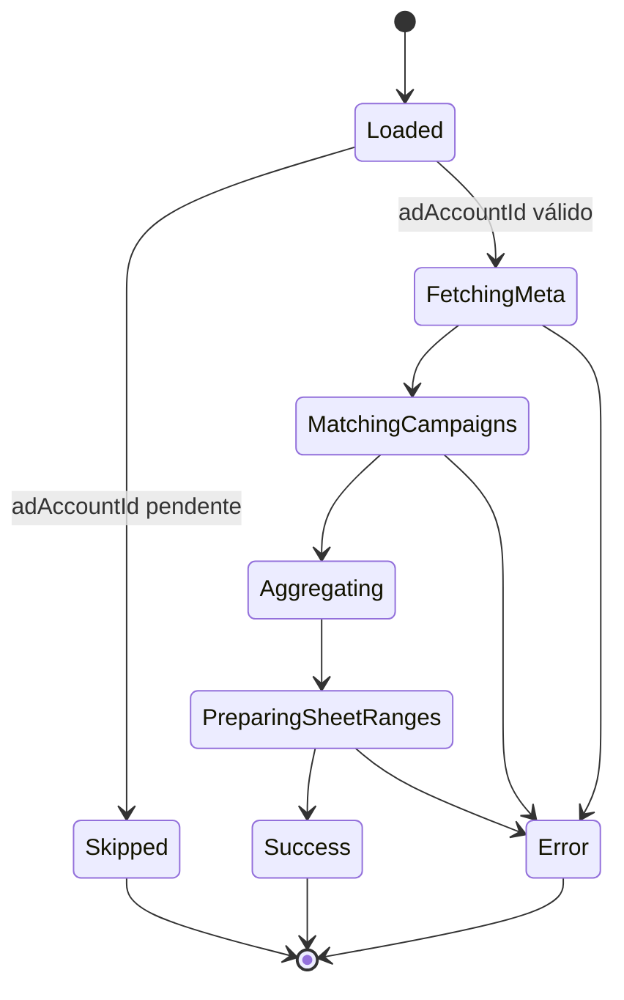
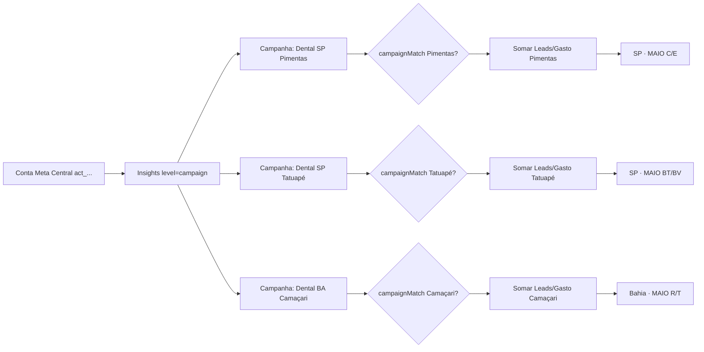

# UML — Dental Leads com Conta Meta Central Compartilhada

Este documento descreve o fluxo arquitetural específico do caso Dental Leads, onde uma única conta Meta Ads central contém campanhas de múltiplas clínicas/unidades.

---

## 1. Decisão arquitetural

A Dental Leads não será modelada como uma conta de anúncio por clínica.

O modelo operacional é:

```text
Empresa Dental Leads
  -> conta Meta Ads central
      -> campanhas representam clínicas/unidades
          -> campaignMatch identifica a clínica correta
              -> Leads e Valor são preenchidos na planilha literal
```

---

## 2. Visão geral do fluxo



---

## 3. Componentes envolvidos



---

## 4. Diagrama de classes do caso Dental



---

## 5. Sequência — Preenchimento por conta central



---

## 6. Máquina de estados — Unidade no preenchimento Dental



---

## 7. Fluxo de dados detalhado



---

## 8. Regras arquiteturais

1. A conta Meta central é herdada pelo grupo de unidades.
2. A clínica/unidade não precisa possuir `adAccountId` próprio.
3. Toda unidade em conta compartilhada precisa de `campaignMatch`.
4. A coleta principal para a planilha literal usa `level=campaign`.
5. O filtro por clínica acontece depois da coleta.
6. A escrita na planilha deve alterar apenas `Leads` e `Valor`.
7. Fórmulas de CPL e totais devem ser preservadas.
8. Erro em uma clínica não deve parar as demais.
9. `dry-run` deve mostrar ranges antes de qualquer escrita real.

---

## 9. Critérios de aceite arquitetural

Este fluxo estará arquiteturalmente aceito quando:

- o registry carregar SP e Bahia;
- cada unidade herdar a conta Meta central;
- cada unidade possuir `campaignMatch`;
- o job buscar campanhas na conta central;
- o matcher separar campanhas por clínica;
- o agregador somar leads e gasto por dia;
- o writer preencher apenas Leads e Valor;
- os documentos README, Roadmap, M2 e UML estiverem coerentes.
