# Documento de Arquitetura UML — Tráfego Automator

---

## 1. Objetivo

Este documento descreve a arquitetura alvo do Tráfego Automator usando diagramas UML/Mermaid. O objetivo é orientar a evolução do projeto para uma plataforma multi-cliente, modular, segura e escalável.

---

## 2. Visão Arquitetural Geral

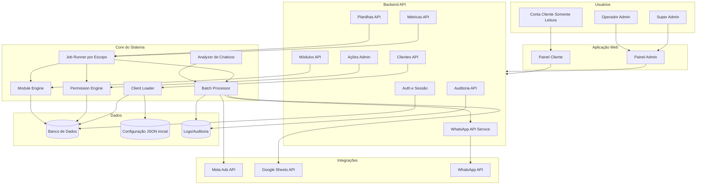

---

## 3. Organização de Clientes

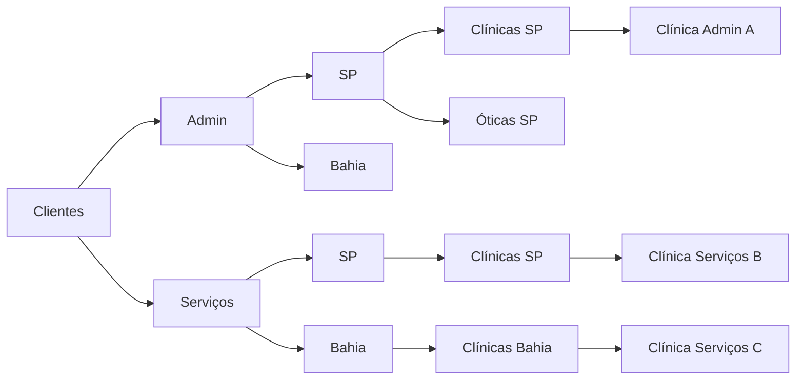

---

## 4. Arquitetura por Camadas

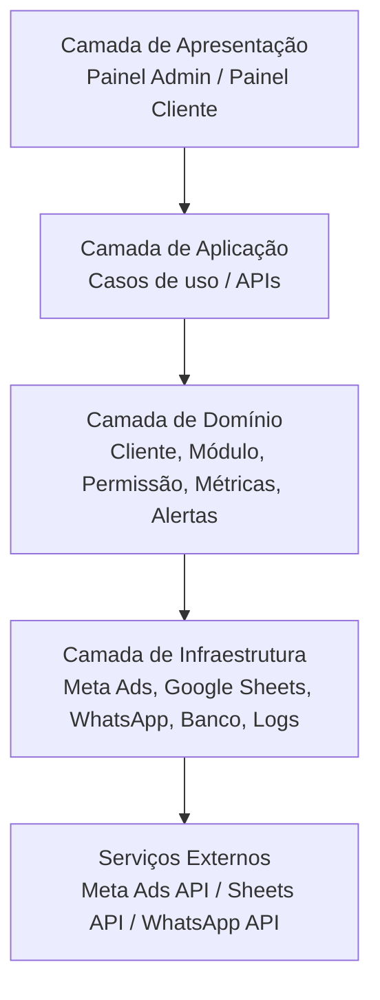

---

## 5. Diagrama de Classes — Domínio Principal

```mermaid
classDiagram
  class Client {
    +string id
    +string key
    +string name
    +string group
    +string region
    +string segment
    +boolean enabled
    +MetaConfig meta
    +SheetConfig sheets
    +WhatsappConfig whatsapp
    +Rules rules
    +Modules modules
  }

  class Modules {
    +boolean pullMetaMetrics
    +boolean fillSheet
    +boolean sendWhatsappReport
    +boolean analyzeCreatives
    +boolean checkBalance
    +boolean uploadCreative
    +boolean createCampaign
    +boolean createAdset
    +boolean pauseAds
    +boolean createTestCampaign
  }

  class Rules {
    +number maxCpl
    +number minCtr
    +number maxSpendWithoutLead
    +number minBalance
    +boolean requireApproval
    +number maxDailyBudgetCents
  }

  class MetaConfig {
    +string adAccountId
    +string businessId
    +string pixelId
  }

  class SheetConfig {
    +string spreadsheetId
    +string tabPrefix
    +string template
  }

  class WhatsappConfig {
    +boolean enabled
    +string to
    +string provider
  }

  class User {
    +string id
    +string name
    +string email
    +string role
    +boolean active
    +Scope scope
    +UserPermissions permissions
  }

  class Scope {
    +string[] groups
    +string[] regions
    +string[] segments
    +string[] clients
  }

  class UserPermissions {
    +boolean viewDashboard
    +boolean editClient
    +boolean editModules
    +boolean pullMetaMetrics
    +boolean fillSheet
    +boolean sendWhatsappReport
    +boolean uploadCreative
    +boolean createCampaign
    +boolean pauseAds
    +boolean manageUsers
  }

  class CampaignMetric {
    +string campaignId
    +string campaignName
    +number spend
    +number leads
    +number cpl
    +number impressions
    +number clicks
    +number ctr
    +number roi
    +date dateStart
    +date dateEnd
  }

  class AdsetMetric {
    +string campaignId
    +string adsetId
    +string adsetName
    +number spend
    +number leads
    +number cpl
    +number impressions
    +number clicks
    +number ctr
  }

  class CreativeMetric {
    +string campaignId
    +string adsetId
    +string adId
    +string adName
    +number spend
    +number leads
    +number cpl
    +number impressions
    +number clicks
    +number ctr
    +string analysisStatus
    +string recommendation
  }

  class Notification {
    +string id
    +string clientId
    +string channel
    +string type
    +string destination
    +string status
    +datetime sentAt
  }

  class AuditLog {
    +string id
    +string actorUserId
    +string clientId
    +string action
    +string status
    +datetime createdAt
    +object metadata
  }

  Client --> Modules
  Client --> Rules
  Client --> MetaConfig
  Client --> SheetConfig
  Client --> WhatsappConfig
  User --> Scope
  User --> UserPermissions
  Client "1" --> "many" CampaignMetric
  Client "1" --> "many" AdsetMetric
  Client "1" --> "many" CreativeMetric
  Client "1" --> "many" Notification
  User "1" --> "many" AuditLog
  Client "1" --> "many" AuditLog
```

---

## 6. Caso de Uso — Visão Geral

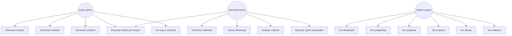

---

## 7. Sequência — Execução Meta Ads para Google Sheets

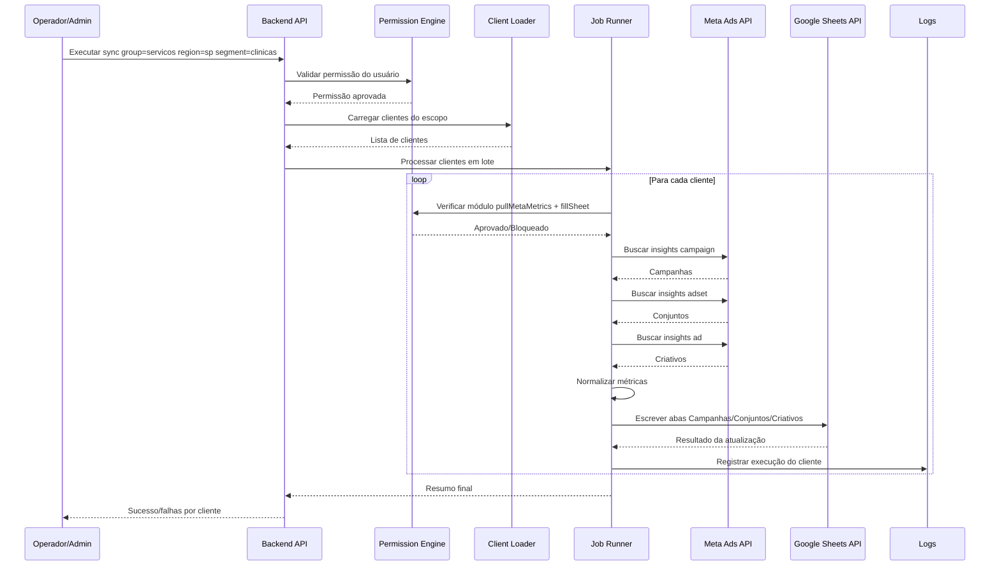

---

## 8. Sequência — Envio WhatsApp por Alerta

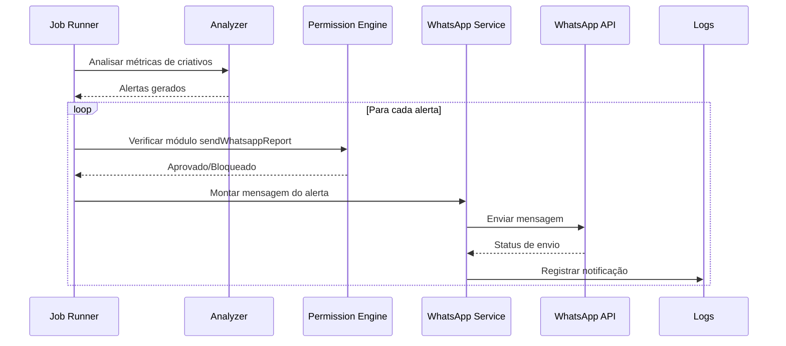

---

## 9. Sequência — Ação Avançada Admin

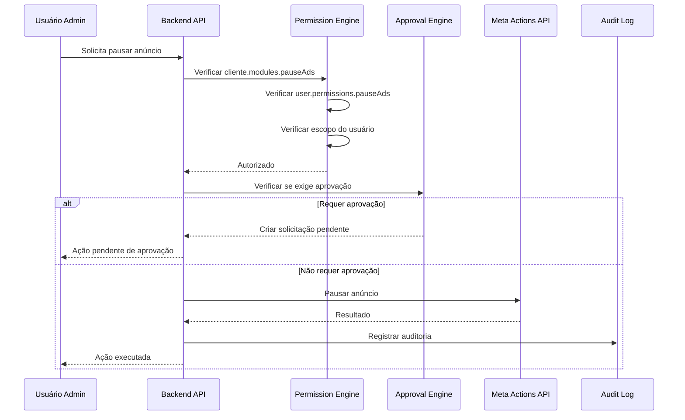

---

## 10. Máquina de Estados — Execução de Job

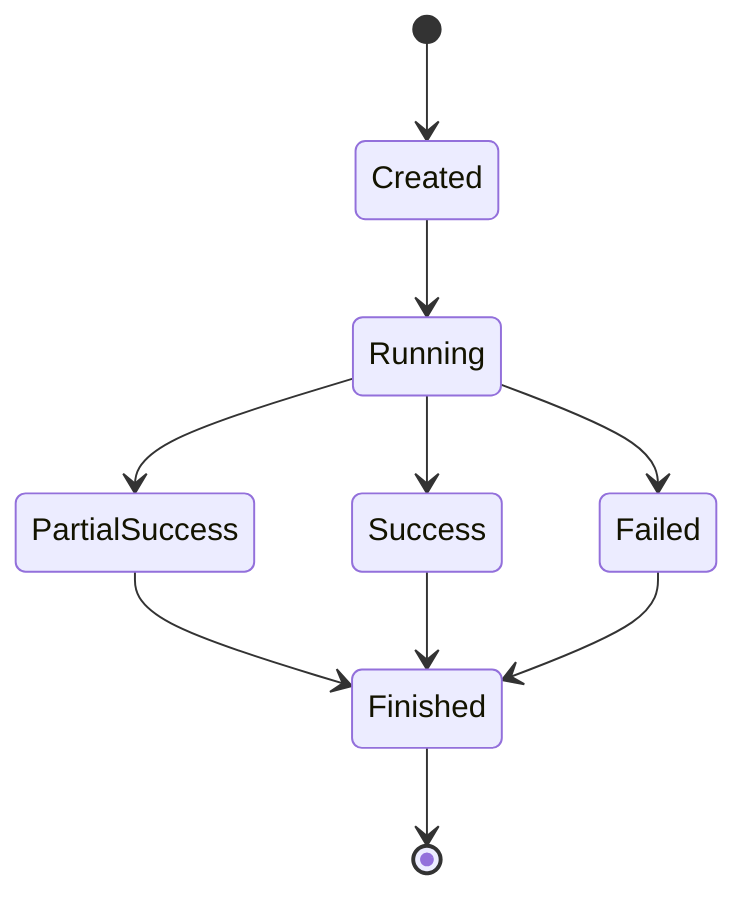

---

## 11. Máquina de Estados — Ação Avançada

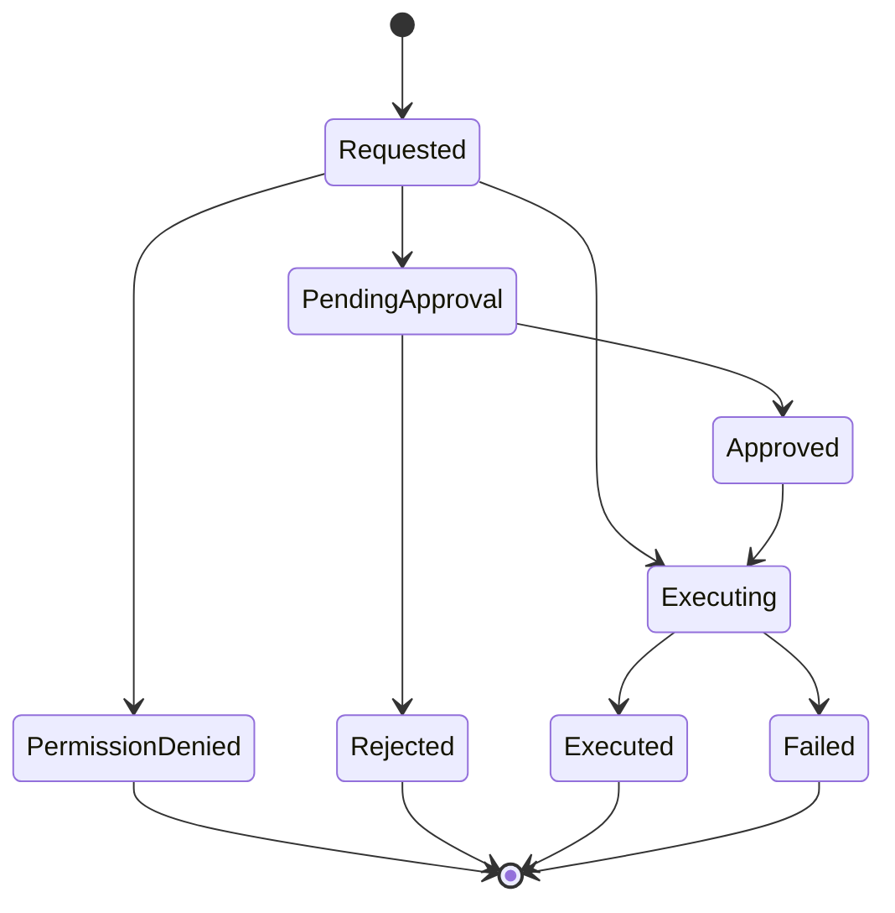

---

## 12. Diagrama de Componentes

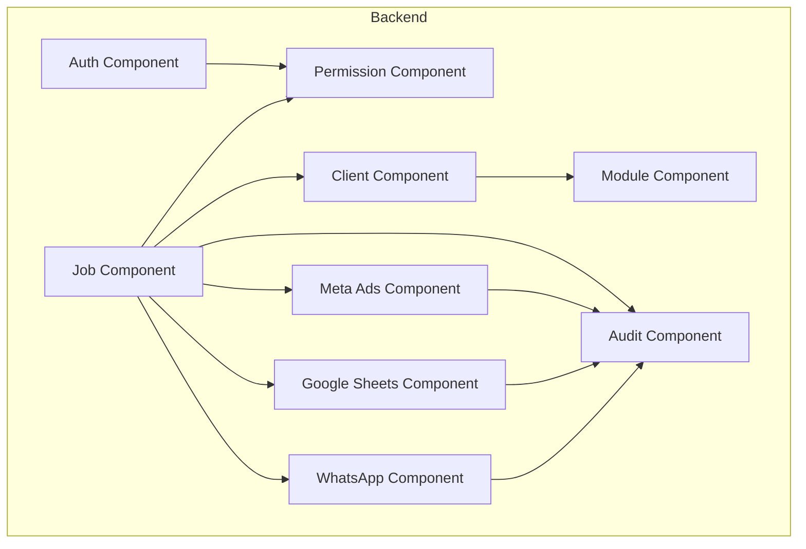

---

## 13. Estrutura de Pastas Alvo

```text
src/
  config/
    clientLoader.js
    moduleDefaults.js
    rulesDefaults.js

  security/
    roles.js
    permissions.js
    scope.js
    authorization.js

  domain/
    metrics.js
    analyzer.js
    modules.js
    clients.js

  services/
    metaAds.js
    metaActions.js
    googleSheets.js
    whatsappApi.js
    auditLog.js

  jobs/
    pullMetaMetrics.js
    fillSheetsFromMeta.js
    analyzeCreatives.js
    sendWhatsappAlerts.js
    runClientScope.js

  web/
    server.js
    mockData.js

  repositories/
    clientRepository.js
    userRepository.js
    executionRepository.js
    auditRepository.js

data/
  clients/
    admin/
      sp/
        clinicas-sp.json
      bahia/
        clinicas-bahia.json
    servicos/
      sp/
        clinicas-sp.json
      bahia/
        clinicas-bahia.json
  users.json
```

---

## 14. Modelo de Banco Futuro

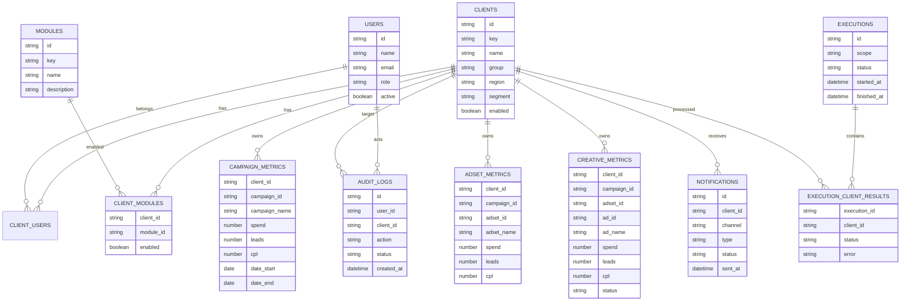

---

## 15. Decisões Arquiteturais

### DA-001 — Separar grupo de cliente e papel de usuário

Grupo do cliente define pacote/módulos. Papel do usuário define permissões.

### DA-002 — Ação real exige módulo + permissão + escopo

Nenhuma ação deve ser executada apenas porque o endpoint foi chamado.

### DA-003 — Começar com JSON e evoluir para banco

A configuração inicial pode usar arquivos JSON para velocidade. Quando o painel crescer, migrar para banco relacional.

### DA-004 — Processar em lote

O sistema deve limitar concorrência para evitar rate limit da Meta Ads API e Google Sheets API.

### DA-005 — Dry-run obrigatório para ações sensíveis

Toda ação avançada deve ser testável em dry-run antes da execução real.

---

## 16. Arquitetura de Segurança

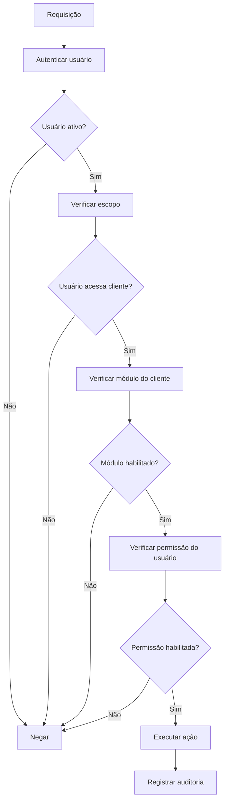

---

## 17. Fluxo de Dados Meta Ads para Planilha

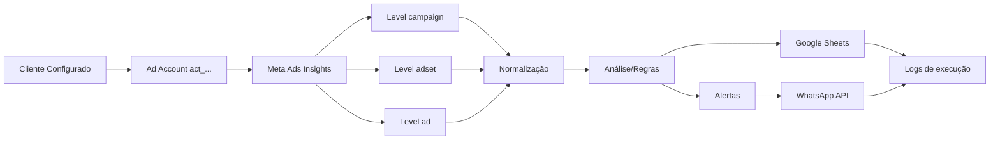

---

## 18. Critérios Arquiteturais de Aceite

A arquitetura será considerada implementada quando:

- clientes puderem ser carregados por grupo/região/segmento;
- módulos forem avaliados por cliente;
- permissões forem avaliadas por usuário;
- Meta Ads for usado como fonte de campanhas/conjuntos/criativos;
- planilhas forem preenchidas automaticamente;
- WhatsApp API enviar mensagens;
- ações avançadas forem protegidas por autorização;
- logs e auditoria forem registrados;
- processamento em lote suportar alto volume de clientes.
